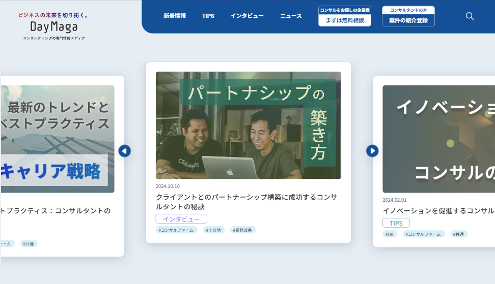

# デイマガ｜コンサル案件・ノウハウ発信メディア



## プロジェクト概要

- **サイト名**：デイマガ（DayMaga）
- **目的・コンセプト**：コンサル案件やノウハウを発信するオウンドメディア型のブログサイトです。CMSとして日々記事が追加・編集される前提で、「運用者が壊しにくく、拡張しやすい」テーマ設計を主なテーマに実装しました。
- **位置づけ**：WordPressオリジナルテーマの**2作品目**です。1作品目「[TETOTE](https://github.com/amemori0/TETOTE-portfolio)」で身につけたコンポーネント設計・アクセシビリティの型を土台に、本作では「執筆者が日々更新するCMS」を前提とした引数設計・タクソノミー拡張・詳細度コントロールへと踏み込んでいます。

> **Note**: 本リポジトリはコード実装の閲覧を目的としたサンプル公開です。`doc/` 以下のセットアップ手順は開発時の運用記録として残していますが、そのままクローンして完全な動作を保証するものではありません。実装の詳細は `src/`・`bin/`・`wordpress/themes/` 配下のコードを直接ご覧ください。

## 技術スタック

- **言語・CMS**：HTML / SCSS / JavaScript / PHP（WordPress オリジナルテーマ）
- **CSS設計**：FLOCSS + BEM
- **ライブラリ**：Swiper.js
- **プラグイン**：Advanced Custom Fields、SEO SIMPLE PACK
- **開発環境**：Vite、`@wordpress/env`（Docker）

## 主な実装機能

- トップページ（MVスライダー・新着記事・人気記事・カテゴリタブ切り替え）
- カテゴリー一覧（`category.php`）／タグ一覧（`tag.php`）／人気記事一覧（`popular.php`）
- 記事詳細（`single.php`・本文からの目次自動生成）
- タブ切り替えの `?category=` URLパラメータによる初期表示制御
- ヘッダー・フッターのナビゲーション配列管理と `aria-current="page"` 付与
- FAQ（カスタムフィールド＋forループによる動的生成）

## 工夫した点

### 設計方針

#### コンポーネントに幅・配置を強制しない設計

- **実装**：component層（`c-*`）には幅や外側marginを持たせず、幅の決定はproject層（`p-*`）側で行います。記事カード本体（`_c-card.scss`）は装飾のみで幅を持たず、列幅・カード幅はproject層のグリッドやスライダーで指定します。

  ```scss
  /* components/_c-card.scss — 幅を持たず装飾だけ */
  .c-card {
    position: relative;
    padding: var(--_card-padding);
    background: var(--color-white);
  }

  /* projects/p-tag.scss — 置かれる場所側で列幅を決める */
  .p-tag__card-list {
    --_columns: 3;
    --_gap: calc(32 * var(--to-rem));
    grid-template-columns: repeat(var(--_columns), minmax(0, 1fr));
    gap: var(--_gap);
  }
  ```

- **理由**：カードが自前で幅を持つと、一覧・スライダー・タグページなど文脈の違う場所へ再配置したときに幅が引き継がれて崩れるためです。
- **効果**：同一の `card.php` ＋ `c-card` を複数レイアウトへ安全に再利用でき、配置ごとの上書き作業が不要になりました。

#### マジックナンバーの回避（カスタムプロパティ + calc）

- **実装**：数値は `--to-rem`（px値をremへ換算するカスタムプロパティ）や意味を持たせたローカル変数で表現し、流体サイズは `clamp()` の計算式で定義しています。

  ```scss
  /* projects/p-tag.scss — 列数・間隔を変数化 */
  .p-tag__card-list {
    --_columns: 3;
    --_gap: calc(32 * var(--to-rem));
  }

  /* 上下パディングをビューポート連動で流体化 */
  .p-article__popular {
    --_clamp-min: 48;
    --_clamp-max: 64;
    --_clamp: clamp(/* min */ …, /* 375〜1440pxで線形補間 */ …, /* max */ …);
    padding-block: var(--_clamp);
  }
  ```

- **理由**：裸の数値は意味と依存関係がコードから読めず、ブレークポイントでの調整も追いにくいためです。
- **効果**：「何の値か」がコードに残り、列数や間隔の変更が変数1つで完結します。流体サイズもブレークポイント境界で段差なく変化します。

#### 翻訳されたくない固有名詞（ロゴ）に `translate="no"`

- **実装**：ロゴリンクに `translate="no"` を付与しています（`template-parts/header.php:31`）。

  ```php
  <a href="<?php echo esc_url(home_url("/")); ?>" translate="no">
    <?php include get_theme_file_path("/assets/images/logo_fixed.svg"); ?>
  </a>
  ```

- **理由**：ブラウザの自動翻訳がサービス名（デイマガ）を別語へ置き換えると、ブランド表記が破壊されるためです。
- **効果**：翻訳環境でもロゴ・サービス名が原文のまま保たれます。

### テンプレート設計（CMS運用を見据えた実装）

#### 1. `card.php` 共通コンポーネントの引数設計

- **実装**：記事カードを `get_template_part()` の共通パーツとして1本化し、呼び出し側から差分を引数で注入する設計にしました。
  - `item_tag`：一覧ページ（`ul > li`）とトップのSwiper（`div`）でラッパータグを切り替え
  - `card_status`：カードのバリエーション制御
  - `is_first` / `$slide_index`：最初のカードの画像にのみ `fetchpriority="high"` を付与しLCPを最適化
  - `item_tag` はホワイトリスト（`li` / `div`）で検証し、不正なタグ名の混入を防止

#### 2. 本文からの目次自動生成

- **実装**：2段構えの仕組みで目次を生成しています。
  1. `the_content` フィルターで本文中のh3 / h4に `sanitize_title()` ベースのidを自動付与
  2. 同じ本文から正規表現でid付き見出しを抽出し、h3 / h4の階層付きリストとしてアンカーリンクを出力
- **理由**：CMSでは執筆者が管理画面で見出しを自由に増減するため、目次の手入力運用は本文とのズレが必ず発生します。
- **効果**：手入力ゼロで目次と本文が常に一致し、執筆者の運用負担と表示崩れのリスクを同時に解消しました。

#### 3. メインクエリ / `WP_Query` / `pre_get_posts` の使い分け

- **実装**：一覧の表示件数・並び順は `pre_get_posts` フックで制御し、トップのMV・新着・人気などメインとは別の一覧は `new WP_Query()` で個別に取得しています。
- **理由**：CSSの `nth-child` で件数を隠す方法では、ページネーションの計算（`max_num_pages`）と実表示がズレる不具合につながるためです。
- **効果**：ページネーションが常に正しく機能し、「どの一覧がどこで制御されているか」がコード上で明確になりました。

#### 4. タクソノミーへのACFフィールド追加によるタグのグループ分け

- **実装**：WP標準ではフラットな構造しか持てないタグ（`post_tag`）に、ACFで「対象／分類／業界」のグループ情報を追加しました。取得は `get_field("tag_group", "post_tag_" . $tag->term_id)` の形式です。
- **理由**：タグをグループ見出し付きで一覧表示する要件があり、標準の器では表現しきれなかったためです。
- **効果**：タクソノミー構造を壊さずに表示要件を満たせました。「標準の器で足りなくなったらACFで拡張する」という判断基準を得ました。

### CSS設計・アクセシビリティ・UX

#### 5. `:where()` による本文タイポグラフィの詳細度ゼロ設計

- **実装**：`the_content` 出力領域の基本スタイルを `:where(.p-single__content)` で詳細度0にし、要素間の余白はLobotomized Owl（`> * + *`）で一括管理しています。
- **理由**：Gutenbergでは執筆者がブロックに個別スタイルを追加する可能性があり、テーマ側の詳細度が高いと個別調整が効かなくなるためです。
- **効果**：後からの上書きが必ず勝つ構造になり、記事ごとの微調整とテーマの一貫性が両立できました。

#### 6. 文書全体で一貫させた見出し階層

- **実装**：h1（ヘッダーロゴ）→ h2（ページタイトル / セクション見出し）→ h3（カードタイトル / 本文大見出し）→ h4（本文小見出し）で統一しています。
- **理由**：スクリーンリーダーの見出しジャンプは文書全体のh1〜h6を順に辿るためです。
- **効果**：支援技術での見出しナビゲーションが全ページで破綻しない構造になりました。

#### 7. カード全体をリンク領域にする定石パターン

- **実装**：`ul > li > article` でマークアップし、article内の擬似要素 `::after` を `inset: 0; z-index: 1` で全面に広げてリンク領域化しています。カード内のカテゴリリンクには個別に `z-index: 2` を指定しています。
- **理由**：「aタグの中にaタグ」というHTML違反を避けつつ、カード全体をクリック可能にする必要があったためです。
- **効果**：セマンティクスを保ったまま操作性を確保でき、カード内の別リンクも独立して機能します。

#### 8. カードの支援技術対応

- **実装**：見出しに `id`、`article` に `aria-labelledby` を指定してカードのタイトルを支援技術に紐付けています。投稿日には `u-sr-only` のラベルを追加し「投稿日: 2026.12.4」のように意味付きで読み上げさせています。
- **理由**：日付やカテゴリ名は視覚的には文脈で伝わりますが、読み上げでは「何の情報か」が欠落するためです。
- **効果**：カード一覧をスクリーンリーダーで辿った際に、各カードの内容と付随情報が正しく伝わるようになりました。

#### 9. `height: 0` と `overflow: hidden` のセット運用

- **実装**：タブパネルの非表示制御を `height: 0; overflow: hidden;` のセットで統一しています。
- **理由**：`height: 0` 単体では「計算上の高さが0」なだけで中身は本来の高さのままレイアウトに影響し続け、footer上に謎の余白が発生する不具合を経験したためです。
- **効果**：非表示パネルがレイアウトへ影響しなくなり、同種の余白バグの再発を防ぐコーディング規約として定着しました。

#### 10. `1lh` を使ったアイコンとテキスト1行分の中央揃え

- **実装**：見出しの `font-size` / `line-height` を親に置いてsvgとテキスト双方に継承させ、`margin-block: calc((1lh - アイコン高さ) / 2)` で1行分の高さに対して中央揃えしています。
- **理由**：`1lh` はその要素自身のline-heightを参照するため継承設計が必要で、幅基準＋`height: auto` では計算に使う値と実描画高さが食い違うためです。
- **効果**：見出しが改行してもアイコンが1行目に正確に揃い、フォントサイズが流体的に変わっても崩れません。

### パフォーマンス

#### 画像の読み込み優先度の使い分け（`fetchpriority` / `loading="lazy"`）

- **実装**：ファーストビューに来る画像は `fetchpriority="high"` で優先取得し、それ以降は `loading="lazy" decoding="async"` に切り替えています。一覧では `card.php` の `is_first` 引数（工夫1参照）で最初の1枚だけを高優先度にし、記事詳細のアイキャッチ（`single.php:43-46`）も同様に `fetchpriority="high"` を付与しています。

  ```php
  // template-parts/card.php — 先頭カードだけ高優先度、2枚目以降は遅延
  $img_attrs = $is_first
    ? ["alt" => "", "fetchpriority" => "high"]
    : ["alt" => "", "loading" => "lazy", "decoding" => "async"];
  the_post_thumbnail("full", $img_attrs);
  ```

- **理由**：LCP候補になる先頭画像は最優先で取りたい一方、ビューポート外の画像まで先読みすると帯域を奪い初期表示を遅らせるためです。
- **効果**：ファーストビューの表示を優先しつつ、下部の画像は必要になるまで遅延読み込みされ、初期ロードの通信量を抑えられます。

### アクセシビリティ・UX（追補）

#### タップターゲット44pxのカスタムプロパティ運用

- **実装**：小さなアイコンボタンに、最小サイズをローカル変数で結合して確保しています（`_c-button-search.scss:4-10`、`_p-header.scss:250-259` の閉じるボタンも同様）。

  ```scss
  .c-button-search {
    --_touch-target-size: 44px;
    min-width: var(--_touch-target-size);
    min-height: var(--_touch-target-size);
    display: grid;
    place-content: center;
  }
  ```

- **理由**：44pxはWCAG／Apple HIGが示すタップターゲットの推奨下限で、`min-width` と `min-height` を同じ変数に束ねることで「この2つは同じ値でなければならない」という意図をコード上に明示できるためです。
- **効果**：アイコンが小さくても指で押しやすい当たり判定を確保でき、値の意味づけと変更容易性も両立しました。

#### 抽象的なリンク・ラベルへの `u-sr-only` 補足

- **実装**：視覚上は短い文言のリンクや、記号・数値だけで意味が伝わる箇所に、読み上げ専用テキストを添えています。「もっと見る」の行き先（`front-page/section-new.php:35` / `section-all.php:25`）、カードの投稿日・カテゴリ（`card.php:38,54`、`single.php:32`）、FAQの質問／回答番号（`single/faq.php:14,21`）などで統一的に運用しています。

  ```php
  <a href="<?php echo esc_url(home_url("/all/")); ?>" class="c-button-more">
    <span class="c-button-more__text">もっと見る</span>
    <span class="u-sr-only">新着記事一覧へ</span>
  </a>
  ```

  ```php
  <p class="c-card__date">
    <span class="u-sr-only">投稿日：</span>
    <time datetime="<?php echo esc_attr(get_the_date("Y-m-d")); ?>">
      <?php echo esc_html(get_the_date("Y.m.d")); ?>
    </time>
  </p>
  ```

- **理由**：視覚的には周辺の文脈で意味が補える「もっと見る」「2026.12.4」なども、読み上げでは行き先や情報の種類が欠落するためです（工夫8のカード対応を一覧・FAQへ広げたものです）。
- **効果**：同じリンク文言が並んでも読み上げで行き先を区別でき、日付・カテゴリ・FAQ番号も意味付きで読み上げられます。

#### タブUIの `role` / `aria` 属性

- **実装**：カテゴリ切り替えUIをWAI-ARIAのタブパターンでマークアップしています。タブ側は `role="tab"` ＋ `aria-selected` ＋ `aria-controls`、パネル側は `role="tabpanel"` ＋ `aria-labelledby` で相互に関連づけています（`template-parts/tab-list.php`）。

  ```php
  <div class="c-tab__list" role="tablist">
    <button class="c-tab__item" role="tab" id="tab-all"
            aria-controls="panel-all" aria-selected="true" tabindex="0" data-category="all">すべて</button>
    ...
  </div>
  ...
  <div class="c-tab__panel" id="panel-all" role="tabpanel" aria-labelledby="tab-all" data-status="active">
  ```

- **理由**：見た目だけのタブでは、支援技術に「タブとパネルの対応」「今どのタブが選択中か」が伝わらないためです。
- **効果**：`aria-controls` / `aria-labelledby` でタブとパネルが対応づき、`aria-selected` で選択状態が伝わるタブUIになりました。

#### prev/nextを含むヘッダーの `user-select: none`

- **実装**：人気記事セクションのヘッダー（タイトルとprev/next送りボタンを含む）にテキスト選択の無効化を指定しています（`src/assets/styles/projects/_p-popular.scss:8-11`）。

  ```scss
  .p-popular__header {
    //テキスト選択の防止
    -webkit-user-select: none;
    -moz-user-select: none;
    user-select: none;
  }
  ```

- **理由**：スライドを送るためにprev/nextを連打すると、クリックのつもりが見出しやボタン文字を範囲選択して青くハイライトしてしまうためです。
- **効果**：連打しても意図しないテキスト選択が起きず、操作に集中できます。
